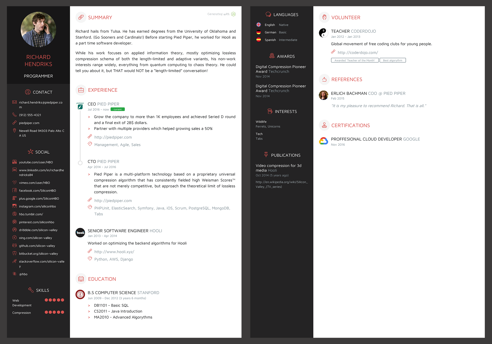

# jsonresume-theme-elite

[](https://travis-ci.org/nass600/jsonresume-theme-elite)
[](https://www.npmjs.com/package/jsonresume-theme-elite)
[](https://www.npmjs.com/package/jsonresume-theme-elite)

Elite theme for [JSONResume](https://jsonresume.org/)



## TOC

1. [Installation](#installation)
2. [Preview](#preview)
3. [Generating your resume in PDF](#generating-your-resume-in-pdf)
4. [Resume data](docs/RESUME_DATA.md)
5. [Design customizations](docs/DESIGN_CUSTOMIZATIONS.md)

## Installation

If you want to generate your resume directly from this repository, the installation is
the same as any other javascript project with NPM dependencies.

```bash
npm install
```

#### Using Docker (recommended)

This project comes with a Dockerfile to provide you the needed software dependencies. You can build the container by running:

```bash
docker-compose build
```


## Preview

If you need to do some modifications in the design you can serve the
resume in the browser in one of the following ways.

### Using Docker (recommended)

```bash
docker-compose up
```

Then you can access the browser preview of your resume at `0.0.0.0:4000`.

### Local environment

```bash
npm start
```

Then you can access the browser preview of your resume at `localhost:4000`.


If you are going to perform several exchanges you can access the hot reload
version using port `4001` so every time you change something the page
would be reloaded to render the latest changes.


## Generating your resume in PDF

By default the latest version of resume-cli only supports rendering the
resume in `Letter` format.

I introduce some changes so you are able to generate it in every format
supported by [PhantomJS](http://phantomjs.org/api/webpage/property/paper-size.html):

+ A3
+ A4
+ A5
+ Legal
+ Letter
+ Tabloid

Again, you have two ways of exporting the resume depending on your environment:

### Using Docker (recommended)

By running the following command you will export it in `A4` format:

``` bash
docker-compose run web npm run export
```

But if you want to use other supported formats you can run:

```bash
docker-compose run web node_modules/.bin/gulp export --page-format A3
```

### Local environment

By running the following command you will export it in `A4` format:

```bash
npm run export
```

But if you want to use other supported formats you can run:

```bash
node_modules/.bin/gulp export --page-format A3
```


## Credits

+ Ignacio Velazquez <ivelazquez85@gmail.com>
+ Dev setup based on the amazing [Caffeine theme](https://github.com/kelyvin/jsonresume-theme-caffeine)
+ Some of the icons and all the country flags where made by [Freepik](http://www.freepik.com)
